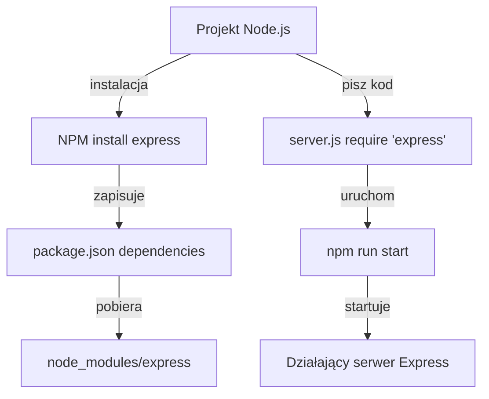

# Zaawansowane aplikacje webowe – Wprowadzenie do backendu w Node.js

## 1) Frontend vs Backend

- **Frontend** – część aplikacji widoczna dla użytkownika (UI): HTML, CSS, JavaScript + frameworki (React/Angular/Vue). Działa w przeglądarce.
- **Backend** – „zaplecze” aplikacji: logika biznesowa, bazy danych, autoryzacja, API. Działa na serwerze (np. Node.js/Express, Python/Django, PHP/Laravel, C#/ASP.NET).

➡️ **Dziś zaczynamy od backendu w JavaScript – w środowisku Node.js.**

---

## 2) Co to jest Node.js?

- **Node.js** to środowisko do uruchamiania JavaScript **poza przeglądarką** (na serwerze).
- Oparte na silniku **V8** (jak Chrome).
- **Asynchroniczne, event-driven I/O** – świetne do serwerów HTTP, API, WebSocketów.
- Ma **wbudowane moduły** (np. `http`, `fs`, `url`) i współpracuje z npm.

📖 Czytaj dalej:  
- Node.js Learn: https://nodejs.org/en/learn  
- API (referencja modułów): https://nodejs.org/api/

---

## 3) Co to jest npm?

- **npm (Node Package Manager)** – menedżer pakietów dla Node.js.
- Instalacja, aktualizacja, wersjonowanie bibliotek z rejestru npm.
- Konfiguracja projektu i skryptów w **`package.json`**.

📖 Czytaj dalej:  
- npm docs: https://docs.npmjs.com/  
- npm CLI: https://docs.npmjs.com/cli/v10/commands

---

## 4) Instalacja Node.js (rekomendacja: nvm)

**Dlaczego nvm?** Umożliwia instalację i przełączanie wersji Node bez konfliktów.

### Linux / macOS
```bash
curl -o- https://raw.githubusercontent.com/nvm-sh/nvm/v0.39.7/install.sh | bash
# Otwórz nowe okno terminala, następnie:
nvm install --lts
nvm use --lts
node -v
npm -v
```

Windows
 - Zainstaluj nvm-windows: https://github.com/coreybutler/nvm-windows/releases

 - W PowerShell/CMD:

```
bat

nvm install lts
nvm use lts
node -v
npm -v

```

Uwaga: node --watch jest dostępne w Node 18+ (zalecane LTS).

## 5) Start projektu (bez nodemon – tylko --watch)

```
bash
mkdir my-node-app && cd my-node-app
npm init -y
```

W pliku package.json dodaj skrypty:

```
json
{
  "scripts": {
    "dev": "node --watch server.js",
    "start": "node server.js"
  }
}

```
## 6) Najprostszy serwer HTTP (bez frameworka)
Plik: server.js

```js
Skopiuj kod
const http = require('http');

const server = http.createServer((req, res) => {
  // Zawsze odpowiadamy JSON-em (UTF-8)
  res.setHeader('Content-Type', 'application/json; charset=utf-8');

  // Routing minimalny
  if (req.method === 'GET' && req.url === '/') {
    res.statusCode = 200;
    return res.end(JSON.stringify({ message: 'Witaj z Node.js!' }));
  }

  if (req.method === 'GET' && req.url.startsWith('/hello')) {
    res.statusCode = 200;
    return res.end(JSON.stringify({ hello: 'world' }));
  }

  // Fallback 404
  res.statusCode = 404;
  res.end(JSON.stringify({ error: 'Not found' }));
});

const PORT = process.env.PORT || 3000;
server.listen(PORT, () => console.log(`Serwer działa na http://localhost:${PORT}`));

```
Jak to działa (krok po kroku)?
 - require('http') – ładuje wbudowany moduł Node do HTTP.

 - http.createServer((req, res) => { ... }) – callback dla każdego żądania:

 - req – zapytanie (metoda, URL, nagłówki, body),


- res – odpowiedź (status, nagłówki, body).

- Ustawiamy nagłówek Content-Type na JSON.

- Dwa endpointy: GET / i GET /hello…; reszta = 404 Not found.

Uruchom:

```bash
npm run dev  # dzięki --watch kod przeładuje się po zapisie
```
## 7) Obsługa zapytań: ścieżki, query string, body (bez frameworka)
Rozszerzenie server.js:

```js
const http = require('http');
const url = require('url'); // Parser URL i query string

const server = http.createServer((req, res) => {
  res.setHeader('Content-Type', 'application/json; charset=utf-8');

  // GET /echo?name=Rafal
  if (req.method === 'GET' && req.url.startsWith('/echo')) {
    const parsed = url.parse(req.url, true); // true => parsuj query do obiektu
    const name = parsed.query.name || 'Anon';
    return res.end(JSON.stringify({ youSaid: name }));
  }

  // GET /users/42 (parametr ścieżki "na piechotę")
  if (req.method === 'GET' && req.url.startsWith('/users/')) {
    const id = req.url.split('/')[2];
    return res.end(JSON.stringify({ userId: id }));
  }

  // POST /data  (body: JSON)
  if (req.method === 'POST' && req.url === '/data') {
    let body = '';
    req.on('data', chunk => (body += chunk));
    req.on('end', () => {
      try {
        const data = JSON.parse(body || '{}');
        res.statusCode = 201;
        res.end(JSON.stringify({ received: data }));
      } catch {
        res.statusCode = 400;
        res.end(JSON.stringify({ error: 'Invalid JSON' }));
      }
    });
    return; // ważne: czekamy na 'end'
  }

  res.statusCode = 404;
  res.end(JSON.stringify({ error: 'Not found' }));
});

server.listen(3000, () => console.log('http://localhost:3000'));

```

## 8) Co to jest Express?
- Express – lekki framework webowy dla Node.js.

- Upraszcza routing, middleware, parsowanie body, obsługę błędów, CORS itp.

- Kod staje się krótszy i czytelniejszy niż przy czystym http.

📖 Czytaj dalej:

- Express docs (EN): https://expressjs.com/

- Przewodnik (EN): https://expressjs.com/en/guide/routing.html

## 9) Serwer w Express (wersja polecana na zajęcia)
Instalacja:

```bash
npm install express cors
server.js
```
```js
const express = require('express');
const cors = require('cors');

const app = express();

// Middleware:
app.use(cors());          // pozwala łączyć się z innego originu (np. React na :5173)
app.use(express.json());  // automatyczny parser JSON -> req.body

// GET /
app.get('/', (req, res) => {
  res.json({ message: 'Witaj z Express!' });
});

// Query: /echo?name=Rafal
app.get('/echo', (req, res) => {
  const { name = 'Anon' } = req.query;
  res.json({ youSaid: name });
});

// Parametr ścieżki: /users/:id
app.get('/users/:id', (req, res) => {
  res.json({ userId: req.params.id });
});

// POST JSON: /data
app.post('/data', (req, res) => {
  res.status(201).json({ received: req.body });
});

const PORT = process.env.PORT || 3000;
app.listen(PORT, () => console.log(`Express działa na http://localhost:${PORT}`));

```
#### Wyjaśnienie:
- app.use(cors()) – odblokowuje zapytania z frontu na innym porcie.

- app.use(express.json()) – koniec z ręcznym składaniem body.

- req.query – query string, req.params – parametry ścieżki, req.body – JSON body.

- res.json(...) – ustawia nagłówek i serializuje obiekt do JSON.

### 10) Zadania i pełne rozwiązania
Poniżej rozwiązania w Express (wariant A) + bez frameworka (wariant B).
Rekomendowane na lekcji: wariant A (Express).

#### Zadanie 1 — GET /time (aktualny czas serwera)
A) Express – dopisz do server.js:

```js
app.get('/time', (req, res) => {
  res.json({ serverTime: new Date().toISOString() });
});
```
B) Bez frameworka – wewnątrz createServer(...):

```js
if (req.method === 'GET' && req.url === '/time') {
  return res.end(JSON.stringify({ serverTime: new Date().toISOString() }));
}
```
Test (curl):

```bash
curl http://localhost:3000/time
# {"serverTime":"2025-09-03T19:00:00.000Z"}  

(przykład)
```

#### Zadanie 2 — POST /sum (przyjmuje {a, b}, zwraca a+b)
A) Express – dopisz do server.js:

```js
app.post('/sum', (req, res) => {
  const { a, b } = req.body || {};
  const aNum = Number(a);
  const bNum = Number(b);

  if (Number.isNaN(aNum) || Number.isNaN(bNum)) {
    return res.status(400).json({ error: 'a i b muszą być liczbami' });
  }
  res.json({ sum: aNum + bNum });
});
```
B) Bez frameworka – wewnątrz createServer(...):

```js
if (req.method === 'POST' && req.url === '/sum') {
  let body = '';
  req.on('data', ch => (body += ch));
  req.on('end', () => {
    try {
      const { a, b } = JSON.parse(body || '{}');
      const aNum = Number(a);
      const bNum = Number(b);
      if (Number.isNaN(aNum) || Number.isNaN(bNum)) {
        res.statusCode = 400;
        return res.end(JSON.stringify({ error: 'a i b muszą być liczbami' }));
      }
      res.end(JSON.stringify({ sum: aNum + bNum }));
    } catch {
      res.statusCode = 400;
      res.end(JSON.stringify({ error: 'Invalid JSON' }));
    }
  });
  return;
}

```
Test (curl):

```bash
curl -X POST http://localhost:3000/sum \
  -H "Content-Type: application/json" \
  -d '{"a":7,"b":5}'
# {"sum":12}
```

Przypadki brzegowe:

- {"a":"3","b":"2"} → sum: 5 (konwersja Number).

- {"a":"x","b":2} → 400 { error: "a i b muszą być liczbami" }.

- Brak body → 400 (bezpieczne błędy).

#### Zadanie 3 — GET /search?phrase=... (zwraca frazę i jej długość)
A) Express – dopisz do server.js:

```js
app.get('/search', (req, res) => {
  const { phrase = '' } = req.query;
  const s = String(phrase);
  res.json({ phrase: s, length: s.length });
});
```
B) Bez frameworka – wewnątrz createServer(...):

```js
if (req.method === 'GET' && req.url.startsWith('/search')) {
  const { parse } = require('url');
  const parsed = parse(req.url, true);
  const s = String(parsed.query.phrase || '');
  return res.end(JSON.stringify({ phrase: s, length: s.length }));
}
```
Test (curl):

```bash
curl "http://localhost:3000/search?phrase=Hello"
# {"phrase":"Hello","length":5}
```

(Opcjonalnie) Zadanie 4 — Modularny routing w Express
routes/users.js

```js
const express = require('express');
const router = express.Router();

router.get('/:id', (req, res) => {
  res.json({ userId: req.params.id });
});

module.exports = router;

```
server.js (fragment)

```js
const express = require('express');
const cors = require('cors');
const usersRouter = require('./routes/users');

const app = express();
app.use(cors());
app.use(express.json());

app.use('/users', usersRouter); // /users/:id

app.get('/', (req, res) => res.json({ message: 'Witaj z Express (moduły routes)!' }));

app.listen(3000, () => console.log('http://localhost:3000'));
```

Test:

```bash

curl http://localhost:3000/users/42
# {"userId":"42"}
```
#### 11) Testy – szybka ściąga (curl + oczekiwane odpowiedzi)
```bash
# Express:
curl http://localhost:3000/
# {"message":"Witaj z Express!"}

curl http://localhost:3000/time
# {"serverTime":"2025-09-03T19:00:00.000Z"}  (przykład)

curl "http://localhost:3000/echo?name=Rafal"
# {"youSaid":"Rafal"}

curl "http://localhost:3000/search?phrase=Hello"
# {"phrase":"Hello","length":5}

curl http://localhost:3000/users/42
# {"userId":"42"}

curl -X POST http://localhost:3000/data \
  -H "Content-Type: application/json" \
  -d '{"a":1}'
# {"received":{"a":1}}

curl -X POST http://localhost:3000/sum \
  -H "Content-Type: application/json" \
  -d '{"a":7,"b":5}'
# {"sum":12}
```

#### 12) Najczęstsze błędy i szybkie poprawki
- Cannot GET / – brak trasy dla ścieżki; dodaj app.get('/').

- Unexpected token przy POST – wysyłasz body nie-JSON; ustaw nagłówek Content-Type: application/json.

- TypeError: Cannot read properties of undefined (reading 'a') – brak express.json() albo puste body.

- Brak odświeżenia po zmianie pliku – uruchamiaj npm run dev (z node --watch), nie npm start.

### 13) Dodatkowe linki (dla chętnych)
Node.js Learn: https://nodejs.org/en/learn

Node.js API: https://nodejs.org/api/

npm docs: https://docs.npmjs.com/

Express: https://expressjs.com/

MDN – HTTP i podstawy web: https://developer.mozilla.org/pl/


---
---

# Karta pracy – Node.js i Express (Backend)

## 📝 Checklista – co powinieneś umieć po dzisiejszej lekcji?

- [ ] Wiem, co to jest **frontend** i **backend**.  
- [ ] Potrafię wyjaśnić, czym jest **Node.js**.  
- [ ] Potrafię wyjaśnić, czym jest **npm** i do czego służy.  
- [ ] Umiem zainstalować Node.js (np. przez nvm).  
- [ ] Umiem zainicjować projekt (`npm init -y`).  
- [ ] Potrafię uruchomić projekt w trybie obserwacji (`npm run dev` z `node --watch`).  
- [ ] Umiem napisać **najprostszy serwer HTTP** w Node.js.  
- [ ] Rozumiem, jak działa routing w Node.js (`req.method`, `req.url`).  
- [ ] Potrafię pobrać dane z **query string** (np. `/echo?name=Jan`).  
- [ ] Potrafię obsłużyć **JSON body** w zapytaniu POST.  
- [ ] Wiem, czym jest **Express** i jakie są jego zalety.  
- [ ] Umiem napisać serwer w Express, który obsługuje trasy GET i POST.  
- [ ] Umiem uruchomić endpointy:
  - `GET /time` – zwraca aktualny czas serwera,  
  - `POST /sum` – zwraca sumę liczb,  
  - `GET /search?phrase=...` – zwraca frazę i jej długość.  
- [ ] Potrafię przetestować serwer przy pomocy przeglądarki i `curl`.

---

## ❓ Pytania kontrolne

1. **Frontend vs Backend**  
   - Czym różni się frontend od backendu?  
   - Podaj po jednym przykładzie technologii frontendowej i backendowej.  

2. **Node.js**  
   - Co to jest Node.js i na jakim silniku działa?  
   - Do czego służy wbudowany moduł `http`?  

3. **npm**  
   - Co to jest `npm` i jaką rolę pełni plik `package.json`?  
   - Jak uruchomić skrypt zdefiniowany w `package.json`?  

4. **Serwer HTTP w Node.js**  
   - Jak sprawdzić, jaką metodą (GET/POST) przyszło żądanie?  
   - Jak pobrać parametry z adresu `/echo?name=Rafal`?  
   - W jaki sposób obsługujemy body w zapytaniu POST?  

5. **Express**  
   - Jakie są zalety używania Express zamiast czystego modułu `http`?  
   - Jak w Express pobrać:  
     - parametry query (`req.query`),  
     - parametry ścieżki (`req.params`),  
     - dane JSON z body (`req.body`).  

6. **Ćwiczenia praktyczne (sprawdź swoją wiedzę):**  
   - Napisz endpoint `GET /hello/:name`, który odpowie `{"hello": "imię"}`.  
   - Napisz endpoint `POST /multiply` przyjmujący `{a, b}` i zwracający `a*b`.  
   - Napisz endpoint `GET /status`, który zwróci `{status: "ok"}`.  

---

## ✅ Dodatkowe zadanie (dla chętnych)

Spróbuj przenieść trasę `/users/:id` do osobnego pliku w katalogu `routes/` i podłączyć ją w `server.js` za pomocą `app.use('/users', usersRouter)`.

---

## 📚 Materiały do nauki

- Node.js Learn: https://nodejs.org/en/learn  
- npm docs: https://docs.npmjs.com/  
- Express docs: https://expressjs.com/  
- MDN Web Docs (JavaScript, HTTP): https://developer.mozilla.org/pl/
