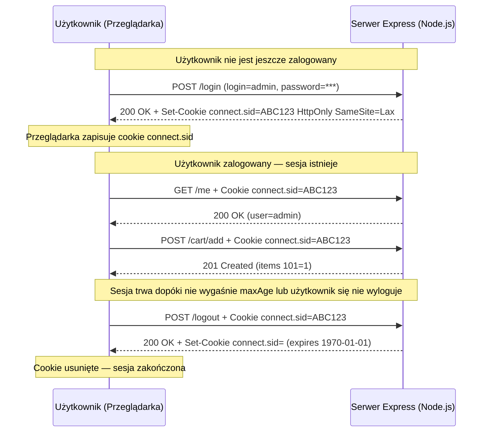

# Diagram przepływu działania sesji i ciasteczek (Express.js)

```mermaid
sequenceDiagram
    participant U as Użytkownik (Przeglądarka)
    participant S as Serwer Express (Node.js)

    Note over U,S: Użytkownik nie jest jeszcze zalogowany

    U->>S: POST /login (login=admin, password=***)
    S-->>U: 200 OK + Set-Cookie connect.sid=ABC123 HttpOnly SameSite=Lax

    Note over U: Przeglądarka zapisuje cookie connect.sid
    Note over U,S: Użytkownik zalogowany — sesja istnieje

    U->>S: GET /me + Cookie connect.sid=ABC123
    S-->>U: 200 OK (user=admin)

    U->>S: POST /cart/add + Cookie connect.sid=ABC123
    S-->>U: 201 Created (items 101=1)

    Note over U,S: Sesja trwa dopóki nie wygaśnie maxAge lub użytkownik się nie wyloguje

    U->>S: POST /logout + Cookie connect.sid=ABC123
    S-->>U: 200 OK + Set-Cookie connect.sid= (expires 1970-01-01)

    Note over U: Cookie usunięte — sesja zakończona
```
